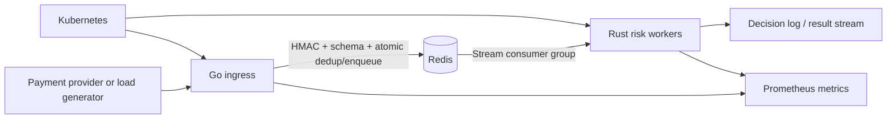

# PulseGate

PulseGate is a high-throughput payment-event reliability and risk gateway for fintech systems that receive webhook traffic from payment providers. It validates signed events, prevents duplicate side effects, admits work quickly, processes events asynchronously, and exposes reproducible systems and ML evaluation evidence.

The repository is designed around one production problem: payment providers retry events, downstream services fail, traffic arrives in bursts, and a slow risk service must not turn webhook acknowledgement into a reliability problem.

## Why this problem

Webhook reliability is a real payments concern. Payment providers can retry delivery when acknowledgements fail. Slow synchronous business logic creates avoidable retries and duplicate pressure. PulseGate therefore keeps the ingress path small and moves risk scoring to asynchronous workers.

## User, input, output

**User:** a fintech platform team integrating payment-provider webhooks.

**Input:** signed JSON payment events containing an event identifier, amount, currency, merchant and transaction-risk features.

**Output:** a fast admission response plus an asynchronously produced risk decision with audit fields, telemetry and deterministic replay behavior.

## Architecture



The Go service owns the latency-sensitive request contract. Redis provides shared idempotency state and a durable-enough demo stream so the ingress service can remain stateless. Rust workers own deterministic feature validation and scoring. Kubernetes demonstrates independent service scaling and recovery. Python is used only for data generation, evaluation orchestration and load testing.

## Why each technology exists

- **Go:** high-concurrency HTTP ingress, explicit timeouts, low-overhead request handling and a small operational surface.
- **Rust:** typed, independently scalable scoring worker with predictable native execution for the compute path.
- **Redis Streams:** one compact shared dependency for atomic idempotency and asynchronous event delivery in the portfolio version.
- **Python:** reproducible evaluation, dataset generation, load tests and benchmark artifact processing.
- **Docker:** reproducible builds for different Go and Rust runtimes.
- **Kubernetes:** independent scaling, health checks, restart behavior and resource limits for the ingress and worker deployments.
- **Prometheus:** metrics that make latency, duplicates, queue pressure, scoring behavior and failures inspectable.

## Run locally

Requirements: Docker with Compose and Python 3.11+.

```bash
cp .env.example .env
docker compose up --build
python -m venv .venv
. .venv/bin/activate
pip install -e '.[dev]'
python scripts/smoke_test.py
python evals/risk_eval.py --worker-url http://localhost:8081
python scripts/load_test.py --url http://localhost:8080/v1/events --rps 1000 --seconds 10
```

See [commands](docs/commands.md) for the complete verification sequence.

## Repository map

```text
apps/gateway/             Go ingress service
apps/risk-worker/         Rust stream consumer and scoring service
evals/                    evaluation datasets, runner and result schema
scripts/                  synthetic data, smoke, load and failure tools
infra/k8s/                Kubernetes manifests
infra/prometheus/         local scrape configuration
docs/                     PRD, design, ADRs, reliability, security, metrics
```

## Evaluation

Systems evaluation records throughput, p50/p95/p99 acknowledgement latency, error rate, duplicate acceptance rate, queue lag and recovery time. ML evaluation records precision, recall, F1, false-positive rate, calibration and inference latency against a deterministic rules baseline.

## Documentation

Start with [docs/README.md](docs/README.md), then read [PRD](docs/PRD.md), [system design](docs/system-design.md), [LLD](docs/LLD.md), and [evaluation](docs/evaluation.md).
