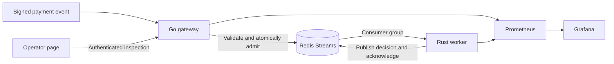

# PulseGate

PulseGate accepts signed payment webhooks, suppresses repeated deliveries, and processes transaction risk asynchronously. It gives payment integrations a clear acknowledgement boundary: an accepted event is queued before the provider receives a response.

Providers retry after timeouts and lost responses. Keeping risk processing outside the request path lets the gateway continue admitting work during a worker restart. Shared replay state prevents gateway replicas from admitting the same event twice.

## Run locally

Install Docker with Compose. Copy `.env.example` to `.env`, replace its placeholder secrets, then run:

```sh
docker compose up --build -d
```

Open [PulseGate](http://localhost:8080). Enter the signing secret from `.env`, send a sample transaction, then replay it. The operator page shows acknowledgements, duplicate suppression, recent decisions and outstanding work.

[Grafana](http://localhost:3000/d/pulsegate-operations/pulsegate-operations) provides the operations dashboard. [Prometheus](http://localhost:9090) collects service telemetry. Host ports bind to loopback.

Use `docker compose down` to stop the services while preserving Redis data.

## Features

- HMAC verification over the original request bytes and a shared, validated event schema.
- Atomic replay detection and enqueueing, with conflicts for changed payloads.
- Bounded worker batches, abandoned-message recovery and idempotent decision publication.
- A versioned, calibrated classifier with matching Python and Rust feature transforms.
- An operator page, provisioned dashboard, health checks and persistent local storage.
- Kubernetes deployments with readiness probes, resource limits and autoscaling policies.

## How it works



Go owns HTTP admission. Redis holds shared replay state, pending work and decisions. Rust consumes batches and runs the exported classifier. Python and scikit-learn provide the training and validation tools. Docker Compose runs the local stack; Kubernetes provides a separate deployment path.

The classifier uses synthetic transaction data. Its decisions demonstrate the pipeline and are not a real fraud assessment. Redis persistence and replay retention define the durability boundary; PulseGate does not execute money transfers or act as a financial ledger.

## Documentation

- [API contract](docs/api.md) and [OpenAPI specification](docs/openapi.json)
- [Local and Kubernetes operations](docs/operations.md)
- [Security and data handling](docs/security.md)
- [Local demo recording](../resources/pulse_gate/artifacts/demo/pulsegate.gif)

## Development

Go, Rust and Python are required to run checks outside containers:

```sh
go test ./apps/gateway/...
cd apps/risk-worker && cargo test --locked
```

From the repository root:

```sh
python -m pip install -e '.[dev]'
python -m pytest -q -p no:cacheprovider
ruff check scripts evals tests
```

Set `PULSEGATE_TEST_REDIS_ADDR` to enable the Redis integration tests. The source tree contains the application, deployment configuration, client tools and tests.
