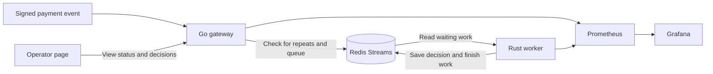

# PulseGate

PulseGate receives payment notifications, remembers which ones it has already accepted, and processes them in the background. It helps an integration handle repeated messages and recover work after a processing worker stops.

A payment notification, or **webhook**, is an HTTP message from a payment provider. If the provider does not receive a response, it may send the same message again. The receiver needs to recognize that retry and avoid repeating the work.

For example, a provider sends an event, loses the response, and retries while a worker is restarting. PulseGate remembers the accepted event, acknowledges the retry, and lets a worker resume unfinished processing. It can keep accepting events while a worker is down, as long as Redis is available and the queue has room.

The included risk worker shows what can happen after an event is accepted: it reads the transaction and records an Allow or Review decision. Its model uses synthetic data and demonstrates the workflow; it is not a validated fraud detector. PulseGate does not move money.

## Run locally

Install Docker with Compose. Copy `.env.example` to `.env`, replace its placeholder secrets, then run:

```sh
docker compose up --build -d
```

Open [PulseGate](http://localhost:8080). Enter the signing secret from `.env`, send a sample transaction, then replay it. The page shows whether the event was accepted or recognized as a repeat, its eventual decision, and how much work is still waiting.

Use a whole-number sample amount from 0 to 900,000 cents. You can press Enter in the amount field to send it. If a response is lost, choose **Retry last** to reuse that event's ID and data. Editing the form does not change the event used by Replay or Retry last.

The decisions view shows when it last refreshed and labels old values when the connection fails. Clearing the signing secret also clears the displayed decisions.

[Grafana](http://localhost:3000/d/pulsegate-operations/pulsegate-operations) shows the operations dashboard. [Prometheus](http://localhost:9090) collects the measurements behind it. These services are accessible only from your machine in the supplied setup.

Use `docker compose down` to stop the services while preserving Redis data.

## Features

- Checks the sender's signature and rejects incomplete or invalid events.
- Remembers accepted event IDs and rejects reuse of an ID with different data.
- Limits waiting work and asks the sender to retry when the queue is full.
- Recovers unfinished work after a worker stops and avoids repeating a stored decision while its completion record is retained.
- Includes a sample risk worker, an operator page and a ready-to-use dashboard.
- Runs locally with Docker Compose, with an optional Kubernetes setup.

## How it works

1. The gateway checks the message and its signature.
2. Redis checks whether the event is already known and queues new work. The gateway then returns `202 Accepted`.
3. A worker reads queued events and records their decisions. A `202` response means the event was accepted; the decision can arrive later.



## What each tool does

| Tool | Role |
| --- | --- |
| Go | Receives and checks HTTP messages, then asks Redis to queue them. |
| Redis Streams | Shares known event IDs, waiting work and decisions across service instances. |
| Rust | Runs the separate sample risk worker. |
| Python and scikit-learn | Generate example data, train the model and check its predictions. |
| Docker Compose | Starts the services together on your machine. |
| Kubernetes | Provides a separate local setup for replicas, health checks and restarts. |
| Prometheus and Grafana | Collect service measurements and display them in a dashboard. |

Redis keeps replay records for a limited time. Once a record expires or stored data is lost, an old event can be treated as new. Storage and recovery details are in the [operations guide](docs/operations.md).

## Documentation

- [API contract](docs/api.md) and [OpenAPI specification](docs/openapi.json)
- [Local and Kubernetes operations](docs/operations.md)
- [Security and data handling](docs/security.md)
- [Local demo recording](../resources/pulse_gate/artifacts/demo/pulsegate.gif)

## Development

Go, Rust and Python are required to run checks outside containers:

```sh
go test ./apps/gateway/...
cd apps/risk-worker && cargo test --locked
```

From the repository root:

```sh
python -m pip install -e '.[dev]'
python -m pytest -q -p no:cacheprovider
ruff check scripts evals tests
```

Set `PULSEGATE_TEST_REDIS_ADDR` to enable the Redis integration tests. The source tree contains the application, deployment configuration, client tools and tests.
