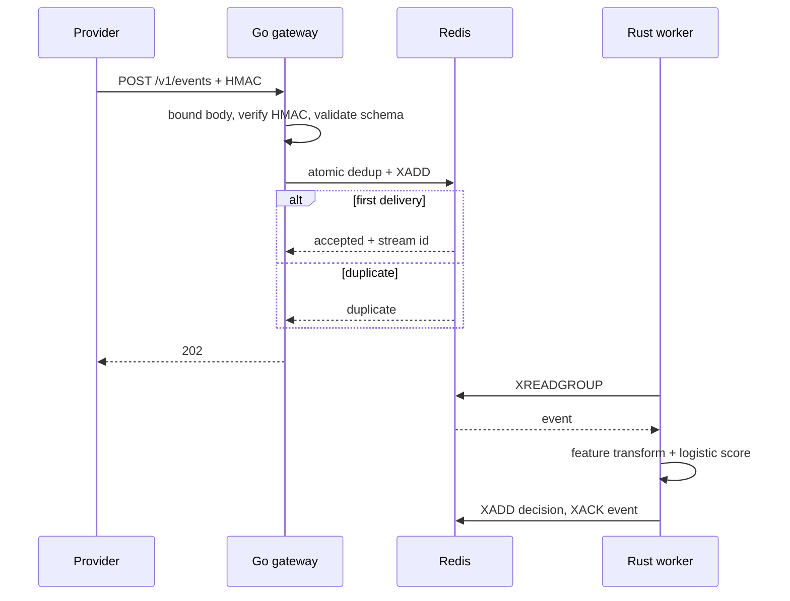

# System design

## Requirements that shape the architecture

The difficult requirement is not raw HTTP throughput by itself. The system must combine fast acknowledgement, safe duplicate handling, asynchronous downstream work, inspectable failure behavior and a build small enough to understand end to end.

## Architecture alternatives considered

### A. Synchronous Go service calls Rust scorer before acknowledgement

Flow: provider -> Go -> Rust -> response.

Advantages: simplest data flow and no broker.

Rejected because: scorer latency and availability become part of webhook acknowledgement. A worker outage makes the provider retry, which multiplies load during the incident. The design also hides the reason to separate the two services.

### B. Go service with an in-memory queue and Rust HTTP workers

Flow: provider -> Go memory queue -> Rust service.

Advantages: very small local implementation and low latency.

Rejected because: accepted events are lost when the gateway process dies, and idempotency state becomes replica-local unless another shared store is added. Kubernetes scaling would weaken correctness.

### C. Go plus Redis Streams plus Rust workers

Flow: provider -> Go -> atomic Redis idempotency/enqueue -> consumer group -> Rust.

Advantages: shared idempotency, asynchronous processing, straightforward local Docker setup, consumer-group scaling, inspectable backlog, fewer moving parts than Kafka.

Selected for the portfolio version.

### D. Kafka or managed event streaming

Advantages: stronger long-term event-stream scale, partitioning, retention and ecosystem.

Deferred because: broker setup, client tuning, partition strategy and operational documentation would dominate a 3 to 4 hour project. The migration boundary is clean because the gateway already produces an event contract and the worker already consumes asynchronously.

## Selected architecture

## Capacity model

Let `lambda` be admitted events per second and `mu` be average events processed per second per worker. Stable queue behavior requires `n * mu > lambda` with enough headroom for burst and restart conditions. If one worker handles 8,000 simple scores/sec in the full stream path and steady ingress is 12,000/sec, two workers provide only 33 percent headroom. Three workers provide 100 percent headroom. The actual worker rate must be measured because Redis round trips, serialization and result persistence dominate the arithmetic model cost.

Queue backlog after an outage of duration `T` grows approximately as `B = lambda * T` while worker capacity is zero. After recovery, drain rate is `n*mu - lambda`. Approximate recovery time is `B / (n*mu - lambda)`. This relationship is what the failure test validates rather than relying on a fixed replica count.

## Idempotency correctness

A naive `SETNX` followed by `XADD` has a failure window:

1. gateway marks event as seen;
2. process or network fails;
3. event never reaches the stream;
4. retry is rejected as duplicate.

PulseGate uses one Redis Lua script to perform the existence check, idempotency write and stream append atomically on the Redis server. This turns the admission boundary into one all-or-nothing operation for the MVP.

The TTL bounds storage but weakens very-late replay protection. A production payments system may persist idempotency records in a financial ledger or durable database for a longer policy window.

## Delivery semantics

The ingress contract provides effectively-once admission within the idempotency retention window. Worker consumption is at least once until a stream entry is acknowledged. The MVP writes the decision and then acknowledges the input, so a crash between those operations can duplicate the decision result. Production choices include an idempotent result key, transactional database write, or one atomic Redis script if Redis remains the source of truth.

No document should claim general exactly-once processing.

## Scaling

- Gateway: stateless apart from Redis, so replicas can scale horizontally.
- Redis: single node for local/demo. Production would use a managed highly available Redis service or replace the stream with Kafka and move idempotency to a durable store.
- Worker: scale horizontally through one consumer group. Each pod uses a unique consumer name.
- Metrics: keep labels bounded. Never label by event id, merchant id or raw country if cardinality is unbounded.

## Production failure modes

- Redis latency spike: p99 ACK rises. Alert on dependency latency before provider timeout behavior becomes visible.
- Redis unavailable: return 503. Do not acknowledge events that were not admitted.
- Worker crash: pending/backlog grows. Replacement consumes new work; pending-entry reclamation is a follow-up requirement.
- Poison event: remains pending. Add DLQ after bounded retries before production use.
- Bad HMAC secret rollout: 401 rate spikes. Secrets must support staged rotation.
- Retry storm: idempotency suppresses duplicate admission, but HMAC and Redis still consume resources. Add rate limiting and provider authentication controls if exposed publicly.

## Why no LLM

Risk scoring is a structured classification problem with deterministic numeric inputs. An LLM would increase latency, cost and nondeterminism without adding a needed language capability. The AI/ML signal in this project comes from an explicit baseline, feature contract, thresholded model, offline evaluation and serving metrics.
